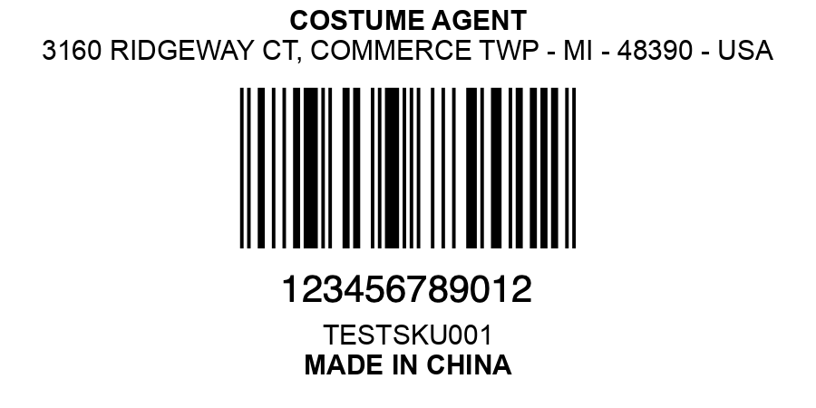

# Simple script to create barcode labels

1. Install the required packages
```pip install -r requirements.txt```

2. Genereate the barcode in svg format go to https://barcodeqrcodegenerator.streamlit.app to generate a barcode.

3. Change the the variables to draw the text: Company Name, Address, SKU, Made in China

The script will generate a label ready to print and stick to the product.

Option to do in bulk run ```bulk_label_generator.py```

Example:
The program takes a SVG barcode and turn into a PNG label barcode with company info.
---

---

---
# Bulk Generation Option

You need a csv file with two columns UPC and SKU to bulk generate labels with the correct UPC and SKU in it.

First run the script```rename_files_from_csv.py``` which it will rename svg files in the correct format "UPC - SKU.svg"

After the files are renamed run the script ```bulk_label_generator.py``` and it will generate the label with the correct SKU in it.


